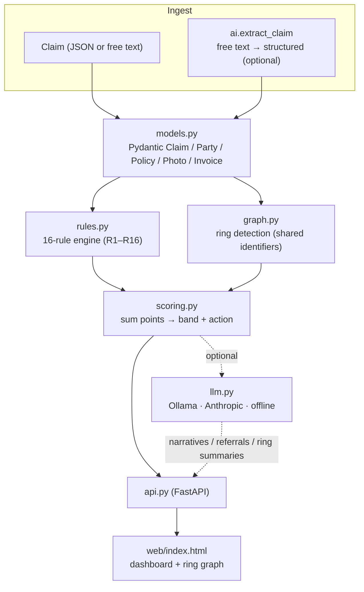

# Fraud Pattern Radar

Explainable insurance **claim-fraud scoring** with **fraud-ring detection**.

A deterministic engine scores every claim against **16 published fraud rules (R1–R16)**, links nominally unrelated claims into **rings** by shared identifiers (phone / bank / address / IP / repairer / attorney), and explains *why* each claim was flagged — every point of the risk score traces to a named rule with a claim-specific reason. An optional local LLM layer adds natural-language investigator narratives and edge features, but **never changes the score** — the deterministic rules remain the single source of truth.

- **Deterministic & explainable** — no black box; each fired rule carries points and a reason.
- **Fraud-ring graph** — cross-claim links surface organized rings around shared entities.
- **Local-first AI** — narratives run on **Ollama** by default (private, free); optionally **Anthropic**; falls back to deterministic templates with no provider at all.

---

## Architecture



### Modules (`backend/fraud_radar/`)

| Module | Responsibility |
|--------|----------------|
| `models.py` | Pydantic models — `Claim`, `Party`, `Policy`, `Photo`, `Invoice`, `Document` |
| `rules.py` | The 16-rule engine (`RULE_CATALOG`); each rule → points + a claim-specific reason |
| `graph.py` | Ring detection and cross-claim signals (feeds R5, R12, R15) |
| `scoring.py` | Orchestrates rules + rings (+ optional LLM narrative) into a banded score |
| `llm.py` | Provider abstraction — Ollama-first, Anthropic optional, graceful offline fallback |
| `ai.py` | AI edge layers — claim extraction, SIU referral memo, ring summary |
| `custom_rules.py` | Propose / validate / adopt org-specific rules (human-in-the-loop) |
| `data/` | Synthetic dataset (`claims.json`, `samples.py`) + thresholds (`config.json`) |
| `api.py` | FastAPI application and endpoints |
| `web/` | Single-page dashboard (`index.html`) + architecture page (`architecture.html`) |

---

## Scoring pipeline

1. **Rules** — each claim is evaluated against R1–R16; fired rules contribute points and a reason.
2. **Rings** — the graph links claims sharing an identifier; ring membership feeds cross-claim rules.
3. **Band** — points are summed into a risk band and a recommended action.
4. **Narrative** *(optional)* — the LLM writes an investigator note; if unavailable, a deterministic template is used.

| Band | Score | Meaning |
|------|-------|---------|
| `low` | < 15 | No action |
| `elevated` | 15–29 | Monitor |
| `high` | 30–49 | Adjuster review |
| `refer_siu` | ≥ 50 | Refer to Special Investigations Unit |

### The 16 rules (points)

| | | | |
|---|---|---|---|
| R1 just-in-time cover (15) | R2 reinstated pre-loss (10) | R3 address mismatch (8) | R4 late report (8) |
| R5 serial claimant (12) | R6 weak-witness timing (5) | R7 above-p90 amount (10) | R8 threshold gaming (12) |
| R9 fabricated invoices (8) | R10 fast-cash + no inspect (10) | R11 missing police report (7) | R12 shared-identifier ring (15) |
| R13 flagged repairer (10) | R14 doc inconsistency (10) | R15 duplicate photo (15) | R16 EXIF mismatch (8) |

Ring detection links claims by shared **phone / bank account / address / IP / repairer / attorney**; R12 fires on ring membership, R5 on repeat claimants, R15/R16 on photo reuse and EXIF anomalies.

---

## AI layer (optional)

`llm.py` resolves a provider at runtime and degrades gracefully:

| Provider | When used | Notes |
|----------|-----------|-------|
| **Ollama** | Default if a local Ollama server is reachable | Private, free; `run.sh` auto-starts `ollama serve` |
| **Anthropic** | If `ANTHROPIC_API_KEY` is set and Ollama isn't used | |
| **Offline** | No provider available | Deterministic templates; scores are unaffected |

**Environment variables:**

| Var | Purpose | Default |
|-----|---------|---------|
| `FRAUD_LLM` | Force a backend: `ollama` \| `anthropic` \| `offline` | auto |
| `FRAUD_OLLAMA_MODEL` | Ollama model for narratives / edge features | `qwen3:8b` |
| `FRAUD_MODEL` | Anthropic model id | `claude-haiku-4-5-20251001` |
| `ANTHROPIC_API_KEY` | Enables the Anthropic backend | — |

The LLM powers narratives, free-text claim extraction, SIU referral drafts, ring summaries, and rule discovery — all with deterministic fallbacks. **It never influences the risk score.**

---

## Run

Requires **Python 3.12**.

```bash
cd backend
python3 -m venv .venv
source .venv/bin/activate
pip install -r requirements.txt

./run.sh                 # -> http://localhost:8000
# or directly:
python -m uvicorn fraud_radar.api:app --host 0.0.0.0 --port 8000
```

Open **http://localhost:8000** for the dashboard (claim queue, ring graph, per-claim explainability) and **/arch** for the architecture page.

**Optional local AI narratives:**

```bash
ollama pull qwen3:8b          # any tool-capable model works
./run.sh                       # auto-detects & starts Ollama
# or Anthropic instead:
ANTHROPIC_API_KEY=sk-... ./run.sh
```

---

## API

| Method & path | Description |
|---|---|
| `GET /` | Single-page dashboard |
| `GET /arch` | Architecture page |
| `GET /api/health` | Provider/offline status + counts |
| `GET /api/claims` | Scored claim summaries, sorted by risk |
| `GET /api/claims/{id}` | Full detail: fired rules, narrative, raw claim |
| `GET /api/claims/{id}/narrative` | On-demand AI investigator note (cached) |
| `GET /api/claims/{id}/referral` | Draft SIU referral memo |
| `GET /api/rules` | R1–R16 catalog joined with live firing data |
| `GET /api/graph` | Fraud-ring network (nodes + edges + rings) |
| `POST /api/score` | Preview-score an ad-hoc claim (no persist) |
| `POST /api/claims` | Add a claim, re-score, persist |
| `POST /api/reset` | Reset the book to the seed dataset |
| `POST /api/extract` | Free text → structured claim (for human review) |
| `POST /api/rules/discover` | AI proposes candidate rules (dry-run, nothing adopted) |
| `GET/POST/DELETE /api/rules/custom` | List / adopt / remove org-specific rules |
| `GET /api/rings/{id}/summary` | Plain-English summary of a fraud ring |

The claim book is held in memory and re-scored on every mutation; runtime additions persist to `data/runtime_claims.json` (kept separate from the pristine seed). `POST /api/reset` returns to the seed.

---

## Tests

```bash
cd backend
.venv/bin/python -m tests.test_scope        # conformance: engine + live API
.venv/bin/python -m tests.test_extensive    # broader engine coverage
```

No pytest dependency; the runners exit non-zero on failure.

---

## Data & privacy

The bundled `data/claims.json` and `data/samples.py` are **synthetic** (fabricated claimants, policies, and repairers) for demonstration. With Ollama, no claim data leaves the host. Do not commit real claim data or credentials — configuration is read from environment variables, never hard-coded.

## Author

**Gembali Bhargav** — [@pruthive580](https://github.com/pruthive580)

## License

MIT © Gembali Bhargav
